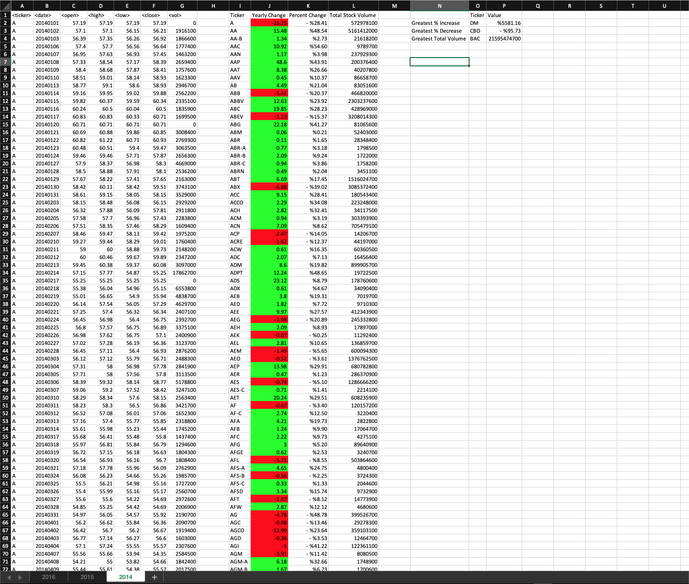
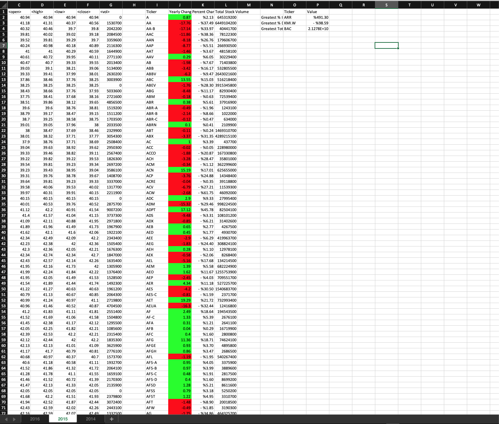
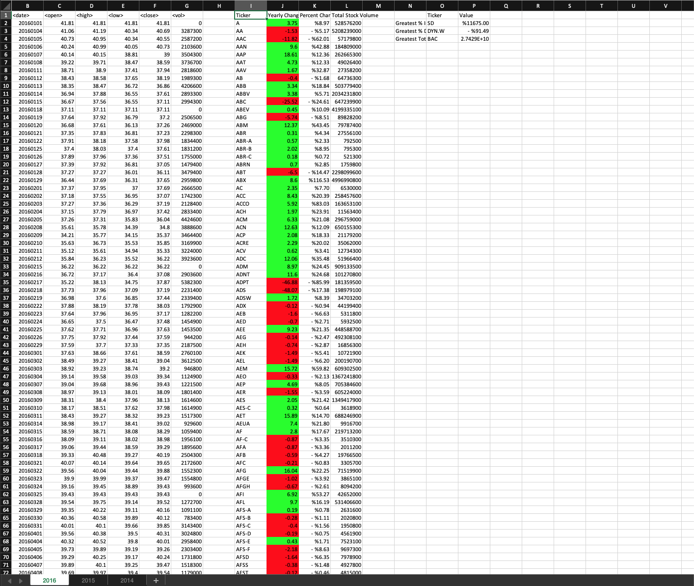

# VBA-challenge

2 VBA scripts create a summary of stock data and save the summary in an Excel workbook. The original data  is in resources folder. 

The data is summarized as follows:

- The ticker symbol of each stock
- Yearly change from opening price at the beginning of the year to the closing price at the end of the year, for each stock.
- The percent change from opening price at the beginning the year to the closing price at the end of the year, , for each stock.
- The total stock volume of each stock.

The first script, script.VBA, will only work on one sheet at a time. 
The second script, BonusScript.vba, will work on all the sheet in the workbook at once. This script also returns the stock with the "Greatest % increase", "Greatest % decrease" and "Greatest total volume"

Below are pictures of the results from BonusScript.vba.

